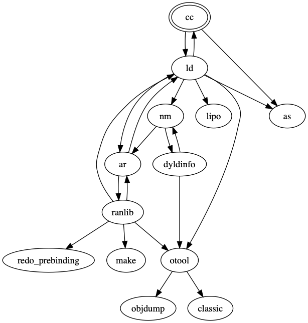
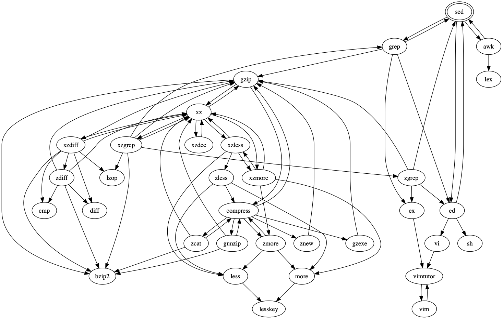

# mangraph

A tool that tries to print a graph (in dot format) of tools related to a given tool (by naively parsing the SEE OTHER-section of man pages).

## Usage

```sh
$ python mangraph.py sed | dot -Tpng -o tools.png
```

## Examples

### cc



### sed


